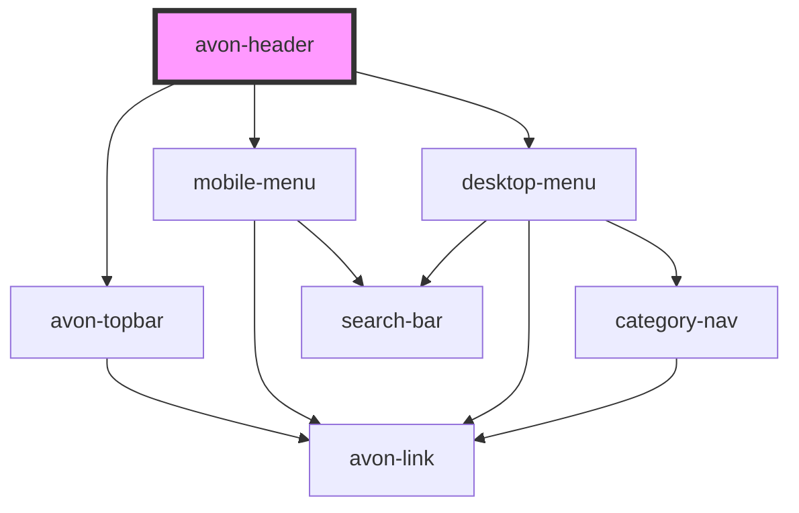

# avon-header

<!-- Auto Generated Below -->

## Properties

| Property  | Attribute | Description | Type     | Default |
| --------- | --------- | ----------- | -------- | ------- |
| `country` | `country` |             | `string` | `'ZA'`  |
| `locale`  | `locale`  |             | `string` | `'en'`  |

## Dependencies

### Depends on

- [avon-topbar](../avon-topbar)
- [mobile-menu](../mobile-menu)
- [desktop-menu](../desktop-menu)

### Graph

----------------------------------------------

*Built with [StencilJS](https://stenciljs.com/)*
