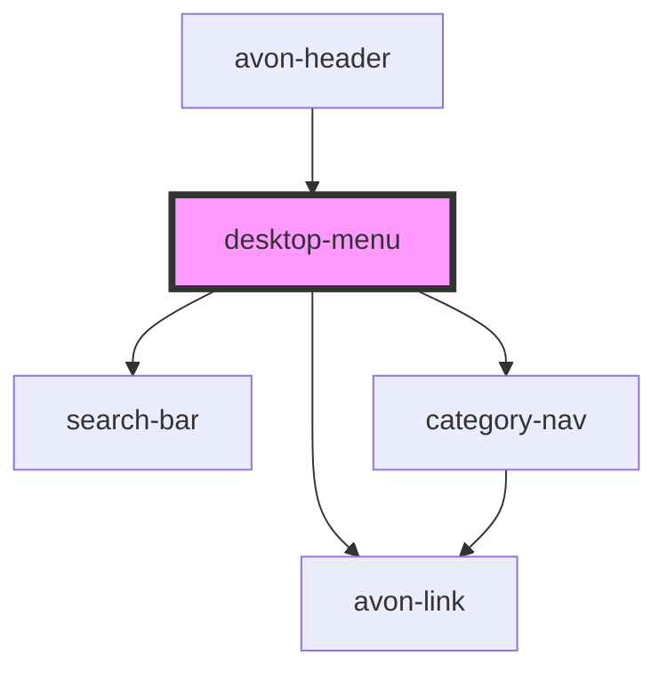

# desktop-menu

<!-- Auto Generated Below -->

## Properties

| Property   | Attribute  | Description | Type  | Default |
| ---------- | ---------- | ----------- | ----- | ------- |
| `data`     | `data`     |             | `any` | `null`  |
| `settings` | `settings` |             | `any` | `null`  |

## Dependencies

### Used by

 - [avon-header](../avon-header)

### Depends on

- [search-bar](../search-bar)
- avon-link
- [category-nav](../category-nav)

### Graph

----------------------------------------------

*Built with [StencilJS](https://stenciljs.com/)*
