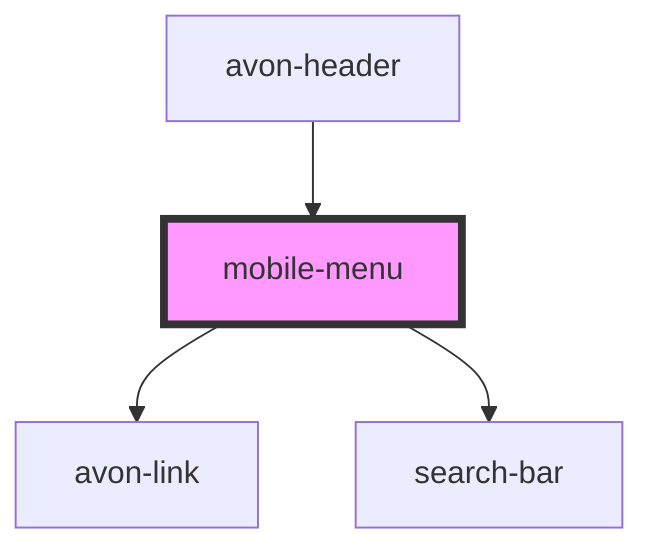

# mobile-menu

<!-- Auto Generated Below -->

## Properties

| Property       | Attribute  | Description | Type    | Default |
| -------------- | ---------- | ----------- | ------- | ------- |
| `categoryList` | --         |             | `any[]` | `[]`    |
| `settings`     | `settings` |             | `any`   | `null`  |

## Dependencies

### Used by

 - [avon-header](../avon-header)

### Depends on

- avon-link
- [search-bar](../search-bar)

### Graph

----------------------------------------------

*Built with [StencilJS](https://stenciljs.com/)*
